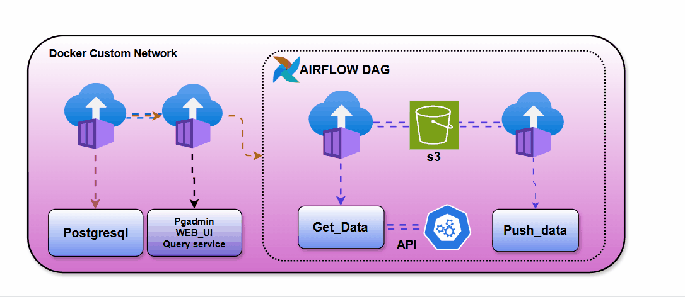

# Containerized Data Ingestion Pipeline with Airflow, PostgreSQL, and S3

This project implements a **production-grade data ingestion pipeline** using **Apache Airflow**, **PostgreSQL**, **AWS S3**, and **Docker**. The pipeline automates CSV data retrieval from an S3 bucket and ingests it into a PostgreSQL database in chunks with live progress tracking using `tqdm`.

---

## Demo



> This GIF shows the Airflow DAG being triggered, the ingestion logs with tqdm progress bar, and data visible in pgAdmin.

---

## Project Features

- **Dockerized architecture** with isolated containers for Airflow, Postgres, and pgAdmin.
- **Airflow DAG** for workflow orchestration and task scheduling.
- **S3 Integration** using `boto3` for pulling CSV files from AWS.
- **Chunked ingestion** to Postgres using `pandas.read_csv(..., chunksize=...)`.
- **Progress tracking** using `tqdm` for efficient monitoring.
- Admin UI with **pgAdmin** for inspecting ingested data.

---

---

## ⚙️ Tech Stack

| Component       | Purpose                          |
|----------------|----------------------------------|
| **Docker**      | Container orchestration          |
| **PostgreSQL**  | Relational database              |
| **pgAdmin**     | GUI to interact with Postgres    |
| **Airflow**     | Workflow orchestration           |
| **boto3**       | AWS SDK to fetch data from S3    |
| **pandas**      | Data processing and transformation |
| **tqdm**        | Real-time ingestion progress bar |

---

## Setup Instructions

### 1. Clone the Repository

```bash
git clone https://github.com/your-username/data-ingestion-airflow.git
cd data-ingestion-airflow

---
---

### 2. 🧪 Create and Populate `.env`
Create a `.env` file in the root directory:

```ini
AWS_ACCESS_KEY=your_aws_access_key
AWS_SECRET_ACCESS_KEY=your_aws_secret_key
AWS_REGION_NAME=your_region
POSTGRES_HOST=airflow
POSTGRES_USER=your_pg_user
POSTGRES_PASS=your_pg_password
```

---

### 3. Install Python Packages (Optional for DAG Developers)
```bash
pip install -r requirements.txt
```

---

### 4. Run Docker Containers
```bash
docker-compose up --build
```

Once up:
- Airflow UI → [http://localhost:8080](http://localhost:8080) (`airflow/airflow`)
- pgAdmin UI → [http://localhost:5050](http://localhost:5050)

---

### 5. Upload CSV File to S3
Make sure:
- The file is present in the correct S3 bucket
- The `python_test_airflow` DAG pushes XComs with `bucket_name` and `key_name` keys  
  _or modify the DAG to hardcode S3 file path for quick testing_

---

### 6. Trigger the Airflow DAG

Using the UI:
- Go to `push_to_postgres` → Click “Trigger DAG”

Or via CLI:
```bash
docker exec -it airflow-webserver airflow dags trigger push_to_postgres
```

---

### 7. Monitor Progress with `tqdm`

Check logs for chunk ingestion progress:
```bash
docker exec -it airflow-webserver airflow tasks logs push_to_postgres push_data
```

---

### 8. Validate in pgAdmin

- Log into pgAdmin
- Open database `ny_taxi`
- Check table `trip_tracker` for ingested records

---

## Cleanup

To shut down and remove volumes:
```bash
docker-compose down -rmi all --volumes --remove-orphans
```

## 📄 License

MIT License. Use freely, modify responsibly.


